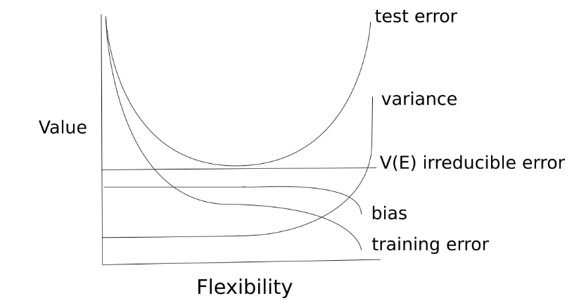

### Conceptual

> 参考资料：[jooolia.github.io/IntroStatLearning/Exercises/chapter_2/chapter_2_questions.html](https://jooolia.github.io/IntroStatLearning/Exercises/chapter_2/chapter_2_questions.html)

1. For each of parts (a) through (d), indicate whether we would generally expect the performance of a flexible statistical learning method to be better or worse than an inflexible method. Justify your answer.

   (a) The sample size $n$ is extremely large, and the number of predictors $p$ is small.

   > **Expectation:** Better performance of flexible methods.
   >
   > - With a  large sample size n, there is enough data to support the estimation of a more complex model without the risk of overfitting.
   > - Since the number of predictores is small, the model can be more flexible without the curse of dimensionality affecting performance negatively.
   >
   > We would expect the performance of a flexible statistical learning method to be better than an inflexible one because with a large n you can approach the true distribution.

   (b)  The number of predictors $p$ is extremely large, and the number of observations $n$ is small.

   > **Expectation:** Better performance of inflexible methods.
   >
   > - When the number of predictors is large relative to the number of observations, flexible methods are likely to overfit the data due to the high risk of model complexity exceeding the information provided by the limited data.
   > - Inflexible methods, with fewer parameters, are less likely to overfit in such "wide" data scenarios.
   >
   > The performance of a flexible statistical learning method would be worse as the probability of overfitting would be very high.

   (c) The relationship between the predictors and response is highly non-linear.

   > **Expectation:** Better performance of flexible methods.
   >
   > - Flexible methods are better at capturing non-linear relationships because they can model complex interactions and non-linear effects. 
   > - Inflexible methods, which often assume linearity, would not perform well in capturing such relationships and could lead to poor predictions.
   >
   > Flexible statistical learning methods are more adapted to non-linear relationships than inflexible methods. The flexible method has better options to approximate the real distribution.

   (d) The variance of the error terms, $i.e. \:σ^2 = Var(ϵ)$, is extremely high.

   > The performance of a flexible statistical method would be worse when the variance of the error term is very high. Overfitting would be a large worry, i.e. that the model is following the errors in the data, so then the flexible approach would likely have lower performance.

2. Explain whether each scenario is a classification or regression problem, and indicate whether we are most interested in inference or prediction. Finally, provide $n$ and $p$.

   (a) We collect a set of data on the top 500 firms in the US. For each firm we record profit, number of employees, industry and the CEO salary. We are interested in understanding which factors affect CEO salary.

   > regression, inference, n = 500, p = 3 (profit, number of employees, industry).

   (b) We are considering launching a new product and wish to know whether it will be a success or a failure. We collect data on 20 similar products that were previously launched. For each product we have recorded whether it was a success or failure, price charged for the product, marketing budget, competition price, and ten other variables.

   > classification, prediction, n=20, p=13(price charged for the product, marketing budget, competition price and ten other variables)

   (c) We are interested in predicting the % change in the USD/Euro exchange rate in relation to the weekly changes in the world stock markets. Hence we collect weekly data for all of 2012. For each week we record the % change in the USD/Euro, the % change in the US market, the % change in the British market, and the % change in the German market.

   > regression, prediction, n=52(we collect weekly data for 2012, and one year consists of 52 weeks), p=4 (For each week, we record, the % change in the USD/Euro, the % change in the US market, the % change in the British market, and the % change in the German market).

3. We now revisit the bias-variance decomposition.

   (a) Provide a sketch of typical (squared) bias, variance, training error, test error, and Bayes (or irreducible) error curves, on a single plot, as we go from less fexible statistical learning methods towards more fexible approaches. The x-axis should represent the amount of fexibility in the method, and the y-axis should represent the values for each curve. There should be five curves. Make sure to label each one.

   > 

   (b) Explain why each of the fve curves has the shape displayed in part (a).

   > - bias - decreases with flexibility because more likely to appropriately fit the data
   > - variance - increases with flexibility because more wobbly, follows the data more
   > - training error - decreases with flexibility - possible to better follow the data with more flexible more
   > - test error - decreases and then increases with flexibility, error increases because model is following noise of data in training set and test data do not have the same noise.
   > - V(E) irreducible error - stays constant with the method because it is an error inherent in the data.

4. You will now think of some real-life applications for statistical learning.

   (a) Describe three real-life applications in which classifcation might be useful. Describe the response, as well as the predictors. Is the goal of each application inference or prediction? Explain your answer.

   > **Credit Scoring**
   >
   > - Response: The creditworthiness of an individual, typically categorized as 'High Risk', 'Medium Risk', or 'Low Risk'.
   > - Predictor: Variables such as credit history, income, employment status, debt-to-income ratio, and existing loans.
   > - Goal: prediction. 
   >
   > **Medical Diagnosis**
   >
   > * Response: The presence or absence of a disease, such as 'Disease X' or 'No Disease X'.
   > * Predictors: Symptoms, patient history, test results, age, family history, and genetic information.
   > * Goal: Both inference and prediction.
   >
   > **Spam Email Detection**
   >
   > - Response: Classification of an email as 'Spam' or 'Not Spam'.
   > - Predictiors: The content of the email, sender information, the presence of certain keywords, the structure of the email, and the use of certain phrases.
   > - Goal: prediction.

   (b) Describe three real-life applications in which regression might be useful. Describe the response, as well as the predictors. Is the goal of each application inference or prediction? Explain your answer.

   > **Economic Forecasting**
   >
   > - Response: Economic indicators such as GDP growth rate, unemployment rate, or inflation rate.
   > - Predictors: Variables like consumer spending, government spending, investment levels, interest rates, and global economic conditions.
   > - Goal：prdiction.
   >
   > **Real Estate Pricing**
   >
   > - Response:  The sale price of a property
   > - Predictors: Square footage, number of bedrooms and bathrooms, location, age of the property, local amenities, and market conditions.
   > - Goal: Both inference and prediction.
   >
   > **Educational Research**
   >
   > - Response: Student performance, often measured by standardized test scores.
   > - Predictors: Variables such as socio-economic status, quality of education, student attendance, teacher qualifications, and classroom size.
   > - Goal: prediction.

   (c) Describe three real-life applications in which *cluster analysis* might be useful.

   > - microarray or gene expression data - samples with similar patterns.
   > - microbial communities - samples with similar functional pathways.
   > - people with similar behaviours in financial transaction data.

5. What are the advantages and disadvantages of a very fexible (versus a less fexible) approach for regression or classification? Under what circumstances might a more fexible approach be preferred to a less fexible approach? When might a less fexible approach be preferred?

   > **Advantages of a very Flexible Approach**
   >
   > - **Complexity Capture:** Flexible models can caputre complex, non-linear relationships and interactions between varables.
   > - **Accuracy:** They often achieve higher accuracy on the **training data** due to their ability to fit the data closely.
   > - **Adaptability:** They can adapt to a wide range of data distributions and are less constrained by assumptions about the data.
   > - **Discovery:** They can reveal underlying patterns and structures in the data that might not be apparent with simpler models.
   >
   > **Disadvantages of a Very Flexible Approach:**
   >
   > - **Overfitting:** There is a high risk of overfitting, especially with very large datasets, where the model learns the noise in the training data.
   > - **Interpretability:** Flexible models can become black boxes, making it difficult to understand the influence of individual predictors.
   > - **Computational Cost:** They often require more computational resources and time for training and prediction.
   > - **Sensitivity to Data Changes:** Highly flexible models may be sensitive to small changes in the data, leading to less stable predictions.
   >
   > **Advantages of a Less Flexible Approach**
   >
   > - **Interpretability:** Simpler models are usually easier to understand and explain, which is important for decision-making.
   > - **Robustness:** They tend to be more robust to small variations in the data and can generalize better to new, unseen data.
   > - **Computational Efficiency:** Less flexible models are typically faster to train and make predictions.
   > - **Stability:** They are less sensitive to changes in the training data, providing more stable estimates.
   >
   > **Disadvantages of a Less Flexible Approach**
   >
   > - **Missed Complexity:** They may not capture all the complexities of the data, leading to underfitting.
   > - **Limited Representation:** They may be too constrained by their simplicity to accurately represent the data's relationships.
   > - **Poor Fit:** In cases where the true relationship is complex, a less flexible model may not fit the data well, leading to lower accuracy.
   >
   > **When to Prefer a More Flexible Approach**
   >
   > - When the data is complex and exhibits non-linear relationships.
   > - When the dataset is large enough to support the complexity of the model without overfitting.
   > - When the goal is to discover underlying patterns in the data.
   > - When interpretability and model simplicity are less of a concern.
   >
   > **When to Prefer a Less Flexible Approach**
   >
   > - When the data is simple or linear relationships are sufficient to describe it.
   > - When the dataset is small, and a simpler model is less likely to overfit.
   > - When interpretability and understanding the impact of individual variables are important.
   > - When computational efficiency and model stability are priorities.

6. Describe the diferences between a parametric and a non-parametric statistical learning approach. What are the advantages of a parametric approach to regression or classifcation (as opposed to a nonparametric approach)? What are its disadvantages?

   > **Differences between a parametric and a non-parametric statistical learning approach.**
   >
   > - Parametric methods make an assumption about the function of the model and that it is linear. 
   > - Non-parametric methods do not assume anything about the function when trying to estimate the fit of the data.
   >
   > **Advantage of parametric**
   >
   > needs less data than a non-parametric test.
   >
   > **Disadvantage of parametric**
   >
   > May not model the true functions and thus may have errors.

7. The table below provides a training data set containing six observations, three predictors, and one qualitative response variable.

   

   Suppose we wish to use this data set to make a prediction for$ Y$ when $X_1 = X_2 = X_3 = 0$ using $K$-nearest neighbors.

   (a) Compute the Euclidian distance between each observation and the test point, $X_1 = X_2 = X_3 = 0.$

   > **Eclidian distance** is
   > $$
   > d=\sqrt[2]{(x_{1test}-x_{1obs})^2+(x_{2test}-x_{2obs})^2+(x_{3test}-x_{3obs})^2}
   > $$
   > Since the test point has all coordinates equal to 0
   > $$
   > d=\sqrt[2]{x_{1obs}^2+x_{2obs}^2+x_{3obs}^2}
   > $$
   >
   > | Obs. | X1 | X2 | X3 | Y     | Euclidean_distance                         |
   > | ---- | ------------- | ------------- | ------------- | ----- | ------------------------------------------ |
   > | 1    | 0             | 3             | 0             | Red   | $d_1=\sqrt[2]{9}=3.000000$                 |
   > | 2    | 2             | 0             | 0             | Red   | $d_2=\sqrt[2]{4}=2.000000$                 |
   > | 3    | 0             | 1             | 3             | Red   | $d_3=\sqrt[2]{1+9}=\sqrt[2]{10}=3.162278$  |
   > | 4    | 0             | 1             | 2             | Green | $d_4=\sqrt[2]{1+4}=\sqrt[2]{5}=2.236068$   |
   > | 5    | -1            | 0             | 1             | Green | $d_5=\sqrt[2]{1+1}=\sqrt[2]{2}=1.414214$   |
   > | 6    | 1             | 1             | 1             | Red   | $d_6=\sqrt[2]{1+1+1}=\sqrt[2]{3}=1.732051$ |

   (b) What is our prediction with$ K = 1$? Why?

   > with $K=1$, our prediction is **Green**.
   >
   > Since KNN with 𝐾=1*K*=1 predicts the response variable 𝑌*Y* based on the value of the nearest neighbor, our prediction for 𝑌*Y* when 𝑋1=𝑋2=𝑋3=0*X*1=*X*2=*X*3=0 would be the value of 𝑌*Y* for the nearest observation. In this case, the value of 𝑌*Y* for Observation 5 is "Green."
   >
   > 

   (c)  What is our prediction with $K = 3$? Why?

   > with $K=3$, our prediction is **Red**
   >
   > because most of the points included are red.

   (d)  If the Bayes decision boundary in this problem is highly nonlinear, then would we expect the best value for $K$ to be large or small? Why?

   > We would expect the best value to be small if the Bayes decision boundary is highly non-linear. This is because a large value would not be flexible enough to model the nonlinear boundary.