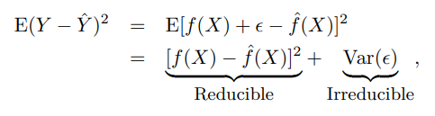
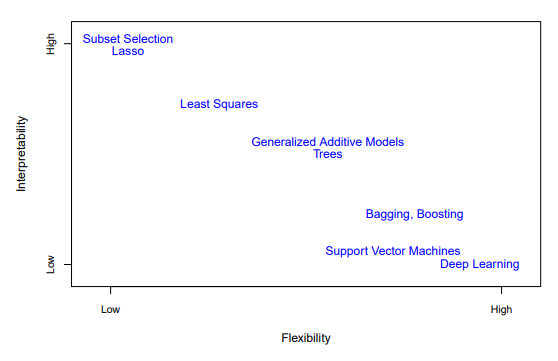
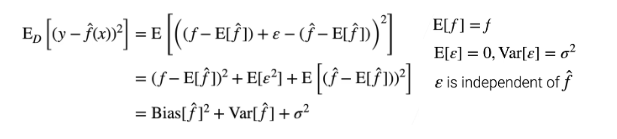
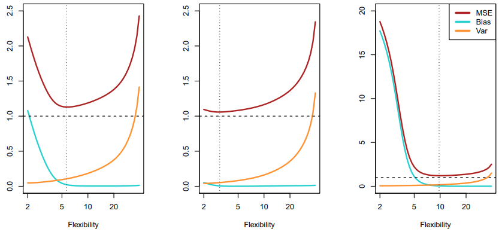
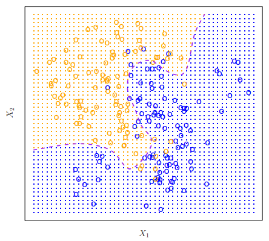
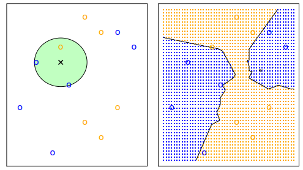
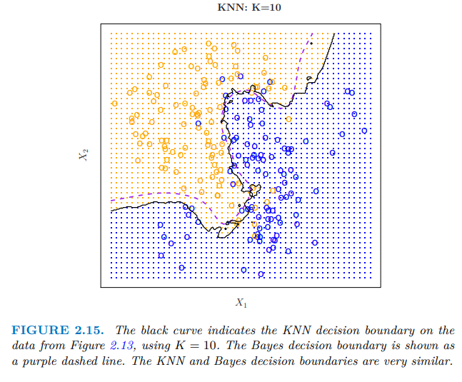
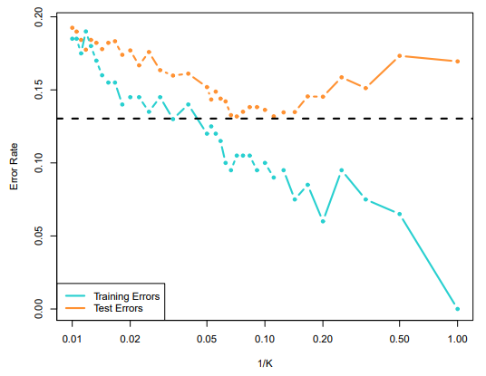

# An Introduction to Statistical Learning with Python -note by Austin

## 说在前面

这份笔记所涉及的资料包含：

- ***An Introduction to Statistical Learning with Python***
- 斯坦福的公开课

这门课围绕的主体为 统计学习，我个人的理解是数据分析

data scientist 数据科学家

# Chapter1-Introduction 

主要的用途

- 识别
- 分类
- 预测

该课程全程使用Python。

监督学习的符号

## The Supervised Learning Problem 监督学习

- Outcome measurement **$Y$** (also called dependent variable, response, target).
- Vector of **$p$** predictor measurements **$X$** (also called inputs, regressors, covariates, features, independent variables).
- In the ***regression problem 回归问题*** , **$Y$** is quantitative (e.g price, blood pressure,定量的).
- In the ***classification problem 分类问题*** , **$Y$** takes values in a finite, unordered set (survived/died, digit 0-9, cancer class of tissue sample).
- We have training data **$(x_1,y_1),...,(x_N,y_N).$** These are observations(examples, instances) of these measurements.

### Objectives

On the basis of the training data we would like to:

- Accurately predict unseen test cases. 准确预测未见过的测试案例
- Understand which inputs affect the outcome, and how. 理解哪些输入影响结果以及如何影响
- Assess the quality of our predictions and inferences. 评估我们预测和推断的质量

### philosophy

- It is important to understand the ideas behind the various techniques, in order to know how and when to use them.
- One has to understand the simpler methods first, in order to grasp the more sophisticated ones.
- It is important to accurately assess the performance of a method, to know how well or how badly it is working [simpler methods often perform as well as fancier ones!]
- This is an exciting research area, having important applications in science, industry and finance.
- Statistical learning is a fundamental ingredient in the training of a modern ***data scientist.***

## The Unsupervised Learning Problem 无监督学习

- No outcome variable, just a set of predictors (features) measured on a set of samples. 没有结果变量的测量，只是一组预测因子
- objective is more fuzzy --- fine groups of samples that behave similarly, find features that behave similarly, find linear combinations of features with the most variation.
- difficult to know how well your are doing.
- different from supervised learning, but can be useful as a pre-processing step for supervised learning.

## Statistical Learning versus Machine Learning

- Machine learning arose as a subfield of Artificial Intelligence.
- Statistical learning arose as a subfeld of Statistics.
- ***There is much overlap*** ---- both fields focus on supervised and unsupervised problems:
  - Machine learning has a greater emphasis on **large scale** applications and **prediction accuracy**.
  - Statistical learning emphasizes **models** and their interpretability, and **precision** and **uncertainty.**
- But the distinction has become more and more blurred, and there is a great deal of “cross-fertilization”.
- Machine learning has the upper hand in ***Marketing!***

## regression function 回归函数

邻平均

# Chapter2- Statistical Learning 统计学习

## 2.1 What Is Statistical Learning？ 什么是统计学习

**EXAMPLE 1 **

The plot displays **sales**, in thousands of units, as a function of **TV, radio, and newspaper budgets**, in thousands of dollars, for 200 different markets. In each plot we show the simple least squares ft of sales to that variable, **each blue line represents a simple model that can be used to predict sales using TV, radio, and newspaper**, respectively.

- **input variables** - ***advertising budgets***

  - use **$X$** to denote the input variable, with a subscript to distinguish them.
  - **$X_1$** - ***TV budget***
  - **$X_2$** - ***radio budget***
  - **$X_3$** - ***newspaper budget***

  > The inputs go by different names, such as predictors, independent variables, features, predictor independent variable feature or sometimes just variables.

- **output variable** - ***sales***

  > The output variable is variable often called the response or dependent variable, and is typically denoted response dependent variable using the symbol $Y$

**More generally**

suppose that we observe a quantitative response $Y$ and $p$ different predictors, $X_1, X_2, . . . , X_p.$ We assume that there is some relationship between $Y$ and $X = (X_1, X_2, . . . , X_p),$ which can be written in the very general form
$$
Y = f(X)\ + ϵ
$$

- $f$ - some fixed but unknown function of $X_1,...,X_p$. In this formula, f represents the systematic information that X provides about Y .
- $ϵ$ - a random error term, which is independent of X and has mean zero.

**EXAMPLE 2 **

- a plot of income versus years of education for 30 individuals in the Income data set.
- The plot suggests that one might be able to **predict income** using **years of education.**
- the function $f$ that connects the input variable to the output variable is in general unknown. In this situation one must estimate $f$ based on the observed points.
- Since **Income** is a simulated data set, $f$ is known and is shown by the blue curve in the right-hand panel.
- **The vertical lines represent the error terms ϵ**. We note that some of the 30 observations lie above the blue curve and some lie below it; overall, the errors have approximately **mean zero**.

### 2.1.1 Why Estimate $f$ ?

**two reasons:**

- prediction 预测
- inference  推理

#### Prediction 

a set of inputs **$X$ are readily available**, but the **output $Y$ cannot be easily obtained**. In this setting, **since the error term averages to zero**, we can predict $Y$ using 
$$
\hat{Y}=\hat{f}(X)
$$

- $\hat{f} - our \:estimate \:for \:f$
- $\hat{Y} - the\: resulting\: prediction\: for \: Y$

The accuracy of $\hat{Y}$ as a prediction for $Y$ depends on two quantities:

- **reducible error** 可避免误差

$\hat{f}$ will not be a perfect estimate for $f$, and this inaccuracy will introduce some error.

But this reducible, we can 

- **irreducible error** 不可避免误差

even we use the form $\hat{Y} =f(X)$， our prediction would still have some error in it!

 This is because $Y$ is also a function of $ ϵ$, $Y=f(X)+ϵ$, by defnition, cannot be predicted using $X$.

- we focus on minimizing the reducible error.

- the irreducible error will always provide an upper bound on the accuracy of our prediction for $Y$. This bound is almost always unknown in practice.

#### Inference

- Which predictors are associated with the response?
- What is the relationship between the response and each predictor?
- Can the relationship between Y and each predictor be adequately summarized using a linear equation, or is the relationship more complicated? 

#### Summary

> 参考资料：[推理（推断）(Inference)与预测(Prediction)-CSDN博客](https://blog.csdn.net/qq_44722189/article/details/137878798)

- **Prediction 预测** ：解释将要发生的事，对于未来事件的估计，基于现有信息猜测结果。
- **Inference 推理** ：理解已发生事件的过程，基于现有数据推断因果关系。
- Depending on whether our ultimate goal is prediction, inference, or a combination of the two, diferent methods for estimating $f $may be appropriate.

### 2.1.2 How Do We Estimate $f$ ?

we want to find a function $\hat{f}$ such that $Y\approx \hat f (X)$ for any observation$(X,Y)$

**two types of approaches:**

- Parametric Methods 参数化方法
- Non-Parametric Methods 非参数化方法

#### Parametric Methods

Parametric methods involve a **two-step model-based approach**.

1. **First, we make an assumption about the functional form, or shape, of $f$**. For example, one very simple assumption is that f is linear in $X$:
   $$
   f(X)= \beta_0+\beta_1X_1+\beta_2X_2+...+\beta_pX_p
   $$

2. **After a model has been selected, we need a procedure that uses the training data to ft or train the model.** In the case of the linear model  , we need to estimate the parameters $β_0, β_1, . . . , β_p.$ That is, we want to fnd values of these parameters such that
   $$
   Y \approx \beta_0+\beta_1X_1+\beta_2X_2+...+\beta_pX_p
   $$

#### Non-Parametric Methods

> [【统计学】参数检验和非参数检验的区别和基本统计学_什么是参数什么是非参数的区别-CSDN博客](https://blog.csdn.net/TUTO_TUTO/article/details/137423304)

### 2.1.3 The Trade-Off Between Prediction Accuracy and Model Interpretability

预测准确性和模型可解释性之间的区别

### 2.1.4 Supervised Versus Unsupervised Learning

监督学习和无监督学习

**cluster analysis 聚类分析**

> [聚类分析（Cluster Analysis）详解-CSDN博客](https://blog.csdn.net/m0_64357419/article/details/132439573)

### 2.1.5 Regression Versus Classifcation Problems

Variables can be characterized as either **quantitative** or **qualitative** (also known as **categorical**)

- **quantitative 定量的** ：age, height, income.
  - ***regression***  problem
- **qualitative 定性的**：a person's marital status(married or not), the brand of product purchased (brand A,B, or C)
  - ***classification*** problem

## 2.2 Assessing Model Accuracy 评估模型准确性

 ***There is no free lunch in statistics:*** no one method dominates all others over all possible data sets.

### 2.2.1 Measuring the Quality of Fit

**mean squared error (MSE)** 均方误差
$$
MSE={1\over n}\sum_{i=1}^n (y_i-\hat f (x_i))^2
$$
 The MSE will be small if the predicted responses are very close to the true responses, and will be large if for some of the observations, the predicted and true responses difer substantially.

- **training MSE**：The MSE is computed using the training data that was used to fit the model, and so should more accurately be referred to as the training MSE. 

- **test MSE**：the average squared prediction error for these test observations $(x_0, y_0).$

$$
Ave(y_0-\hat f (x_0))^2
$$

In practice, one can usually compute the **training MSE with relative ease**, but estimating the **test MSE is considerably more difcult** because usually no test data are available.

**cross-validation(交叉验证)** , which is a crossmethod for estimating the test MSE using the training data. 

### 2.2.2 The Bias-Variance Trade-Off

偏差-方差 权衡

> 1. [参数估计的均方误差（MSE），偏置（Bias）与方差（Variance）分解，无偏估计_mse随正则化参数变化的曲线-CSDN博客](https://blog.csdn.net/RSstudent/article/details/126606711)
>
> 2. [通俗易懂方差（Variance）和偏差（Bias）_偏差和方差-CSDN博客](https://blog.csdn.net/weixin_42327752/article/details/121428875)
> 3. 【5.1 方差和偏差【斯坦福21秋季：实用机器学习中文版】】https://www.bilibili.com/video/BV1H44y1v7Kf?vd_source=93605a6b86030a3f21f575fbc9ec3ccf

the **expected test MSE**, for a given value $x_0$, can always be decomposed into the sum of three fundamental quantities:

- the variance of $\hat f(x_0)$  方差

-  the squared bias of $\hat f(x_0)$   平方偏置（偏差）
-  the variance of the error variance bias terms ϵ 

$$
E(y_0-\hat f(x_0) )^2 = Var(\hat f (x_0))+[Bias(\hat f(x_0))]^2+Var(ϵ)
$$

$E(y_0-\hat f(x_0) )^2$  defines the ***expected test MSE* ** at $x_0$

*这里附上李沐的推导过程*

- **To minimize the expected test error** , we need to select  a statistical learning method that simultaneously achieves ***low variance*** and ***low bias***.

- We can see the expected test MSE can never lie below **Var(ϵ)**, the irreducible error.

- As a general rule, as we use **more fexible methods**, the variance will increase and the bias will decrease.
- The relative rate of change of these two quantities determines whether the test MSE increases or decreases.

the relationship between bias, variance, and test set MSE given is referred ro as ***bias-variance trade-off( 偏差-方差 权衡)***.

**Good test set performance** of a statistical learning method requires **low variance** and **low squared bias**.

**But the challenge lies in finding a method for which both the variance and the squared bias are low.**

### 2.2.3 The Classification Setting

<u>**error rate**</u>

The most common approach for quantifying the accuracy of our estimate $\hat{f}$ is the training ***error rate***, the proportion of mistakes that are made if we apply our estimate $\hat{f}$ to the training observations:
$$
{1\over n}\sum ^n_{i=1}I(y_i\neq \hat{y_i}).
$$

- **$\hat{y_i}$** is the predicted class label for the ith observation using $\hat{f}$
- **$I(y_i\neq \hat{y_i})$** is an **indicator variable** 
  -  **equals 1 if $y_i \neq \hat{y_i}$** ,  it was misclassifed.
  - **zero if $y_i=\hat{y_i}$**,  the ith observation was classifed correctly by our classifcation method

- **Hence this Equation computes the fraction of incorrect classifcations.**

- This equation    ${1\over n}\sum ^n_{i=1}I(y_i\neq \hat{y_i}).$   is referred to as the ***training error rate*** because it is computed based on the data that was used to train our classifer. **<u>*(test error)*</u>**

<u>**test error**</u>

The ***test error rate*** associated with a set of test observations of the form $(x_0, y_0)$ is given by
$$
Ave(I(y_0\neq \hat{y_0}))
$$

- $\hat{y_0}$ is the predicted class label that results from applying the classifer to the test observation with predictor $x_0$.
- A good classifier is one for which the test error is smallest.

#### **<u>The Bayes Classifier</u>**

贝叶斯分类器

> 【【官方双语】医检阳性≠得了病？重新理解贝叶斯定理】https://www.bilibili.com/video/BV1Ei4y1F72M?vd_source=93605a6b86030a3f21f575fbc9ec3ccf
>
> 【【官方双语】贝叶斯定理，使概率论直觉化】https://www.bilibili.com/video/BV1R7411a76r?vd_source=93605a6b86030a3f21f575fbc9ec3ccf

**conditional probability 条件概率**

it is the probability that $Y=j$, given the observed predictor vector $x_0$
$$
Pr(Y=j|X=x_0)
$$
**Bayes classifer 贝叶斯分类器 **

In a two-class problem where there are only two possible response values, say class 1 or class 2, the Bayes classifer corresponds to predicting class one if $Pr(Y=1|X=x_0)>0.5$, and class two otherwise.

**EXAMPLE**

- The orange shaded region refects the set of points for which Pr(Y = orange|X) is greater than 50 %
-  the blue shaded region indicates the set of points for which the probability is below 50 %.
- The purple dashed line represents the points where the probability is exactly 50 %. This is called the ***Bayes decision boundary***.
  -  The Bayes classifer’s prediction is determined by the Bayes decision boundary;

- an observation that falls on the orange side of the boundary will be assigned to the orange class, and similarly an observation on the blue side of the boundary will be assigned to the blue class.

The Bayes classifer produces the lowest possible test error rate, called the ***Bayes error rate.***

- Bayes classifer will always choose the class Bayes error rate for which, $Pr(Y=j|X=x_0)$,   is largest.
- the error rate will be $1-max_jPr(Y=j|X=x_0)$ at $X=x_0$.

In general, **the overall Bayes error rate** is given by
$$
1-E(\underset j{max}Pr(Y=j|X))
$$

-  the expectation averages the probability over all possible values of $X$
- . The Bayes error rate is analogous to the irreducible error.

#### <u>K-Nearest Neighbors</u>

K-邻近算法 KNN

> [K-近邻算法： k-nearest neighbor classification (kNN) 详细介绍_knn算法误差率-CSDN博客](https://blog.csdn.net/chenhepg/article/details/105409153)

In theory we would always like to predict qualitative responses using the Bayes classifer. But for real data, we do not know the conditional distribution of Y given X, and so computing the Bayes classifer is impossible. Therefore, the Bayes classifer serves as an unattainable gold standard against which to compare other methods. Many approaches attempt to estimate the conditional distribution of Y given X, and then classify a given observation to the class with highest estimated probability. One such method is the **K-nearest neighbors (KNN) classifer.**

- $K$ is a positive integer
- $x_0$ is a test observation
- the KNN classifer **frst** identifes the $K$ points in the training data that are closest to $x_0$, represented by $N_0$
- It then estimates the conditional probability for class$ j$ as the fraction of points in $N_0$ whose response values equal $j$ :

$$
Pr(Y=j|X=x_0)={1\over K}\sum_{i\in \N_0}I(y_i=j).
$$

**EXAMPLE**

